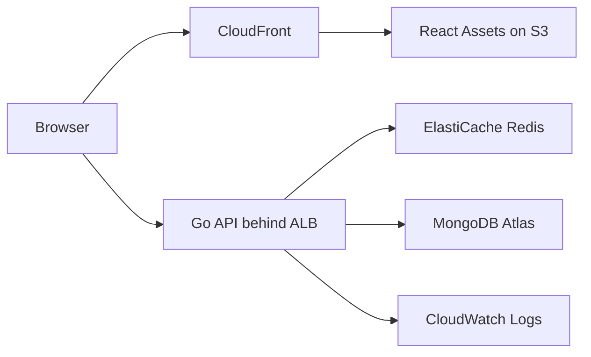

# Application Architecture

The frontend is a React single-page application. It reads `VITE_API_BASE_URL` at build time and calls the backend health endpoint to display live service status.

The backend is a Go HTTP service exposing:

- `GET /healthz`
- `GET /readyz`
- `GET /api/v1/status`

The service supports MongoDB Atlas through `MONGODB_URI` and Redis through `REDIS_ADDR`. When those values are not configured, readiness reports the dependency as `not_configured`; when configured and unreachable, readiness returns `503`.

Logs are structured JSON through Go `slog`, which makes CloudWatch Logs Insights queries easier to write and operate.

